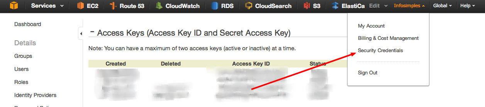
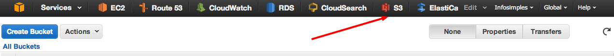
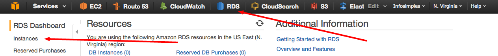
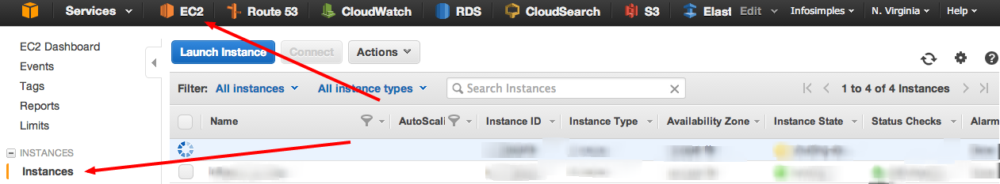

# Infrastructure

## How to set up a new environment on AWS

### 1. Security Credentials

#### Create a new Access Key

*Replace all occurrences of* ***PUT_YOUR_ACCESS_KEY_ID_HERE*** *and* ***PUT_YOUR_SECRET_ACCESS_KEY_HERE*** *in your repository code with the recently created credential*.

### 2. S3 (Simple Storage Service)

#### Create a new bucket with any name you want.

### 3. Security groups

#### Create the following security groups:

| Security Group      | Type   | Protocol  | Port Range  | Source         |
| ---------------     |:------:|:---------:|:-----------:|:--------------:|
| **application**     |        |           |             |                |
|                     | SSH    | TCP       | 22          | 0.0.0.0/0      |
|                     | HTTP   | TCP       | 80          | 0.0.0.0/0      |
| **application_rds** |        |           |             |                |
|                     | MySQL  | TCP       | 3306        | *application** |
| **application_elb** |        |           |             |                |
|                     | HTTP   | TCP       | 80          | 0.0.0.0/0      |

\* *Use the ID of this security group.*

### 4. RDS (Relational Database Service)

#### Create a DB instance with the following settings:

| Attribute                       | Value               |
| ------------------------------- |:-------------------:|
| **DB Engine**                   | mysql               |
| **DB Engine Version**           | 5.6.x               |
| **DB Intance class**            | db.t2.micro         |
| **Multi-AZ**                    | No\*                |
| **Allocated Storage**           | 5GB                 |
| **Use Provisioned IOPS**        | No                  |
| **DB Instance Identifier**      | application-db      |
| **Master Username**             | deploy_workshop     |
| **Master Password**             | stupidpassword      |
| **Confirm Password**            | stupidpassword      |
| **DB Security Group**           | application_rds     |
| **Database Name**               |                     |
| **Database Port**               | 3306                |
| **Backup Retention Period**     | 0                   |
| **Auto Minor Version Upgrade**  | Yes                 |

\* *for the purpose of this workshop we will not use RDS multi-az deployment. However, it's highly recommended for a production environment.*

### 5. EC2 (Elastic Compute Cloud, *aka Virtual Machine*)

#### Prepare a Virtual Machine Image that will run the application:

* Edit the file **recipes/templates/set_env_variables.rb** with your settings
* Launch a new EC2 instance with the most recent Ubuntu Server (HVM) 64 bit using a t2.micro instance class
  * Use 8GB for storage (with general purpose SSD)
  * Select the security group: **application**
  * Create/use the keypair **deploy-workshop**
    * Put your key at **~/.ssh/keys/deploy-workshop.pem**
* SSH into the instance and execute the steps in [setup.sh](provision/setup.sh) and the steps in [application.sh](provision/application.sh)
* Try to open your server public DNS in a browser
* Create a new AMI for this EC2 instance and terminate it
  * **Image name:** application-[region]-[year]-[month]-[day]. *Example: application-us-east-1-2014-08-06.*

### 6. Auto Scaling

#### 6.1 Create a Load Balancer

- **Name:** application_elb
- **Listeners:**

  | Load Balancer Protocol  | Load Balancer Port  | Instance Protocol | Instance Port |
  | ----------------------- |:-------------------:|:-----------------:|:-------------:|
  | HTTP                    | 80                  | HTTP              | 80            |

- **Health Check:**
  - **Ping Protocol:** HTTP
  - **Ping Port:** 80
  - **Ping Path:** /ping
  - **Response Timeout:** 5
  - **Health Check Interval:** 30
  - **Unhealthy Threshold:** 4
  - **Healthy Threshold:** 2
- **Security group:** application_elb
- **Add EC2 Instances:** leave it blank

#### 6.2 Create a Launch Configuration

- **AMI:** Select the AMI you've created on step 5.
- **Name:** application-[region]-[year]-[month]-[day]. *Example: application-us-east-1-2014-08-06.*
- **Monitoring:** [x] Enable CloudWatch detailed monitoring
- **User data:** Paste content from templates/user_data.sh
- **IP Address Type:** Assign a public IP address to every instance
- **Size:** 8GB
- **Security Group:** application
- **Key pair:** deploy-workshop

#### 6.3 Create an Auto Scaling Group

- **Launch Configuration:** select the launch configuration created on the previous step.
- **Group Name:** application-group
- **Group size:** 2
- **Network:** VPC (default)
- **Subnet:** defaults
- **Load Balancing:** application_elb
- **Health Check Type:** EC2
- **Health Check Grace Period:** 180
- **Monitoring:** [x] Enable CloudWatch detailed monitoring
- **Create Auto Scaling Group:**
  - **min/max instances:** 2/4
  - **Increase:**
    - **Add a new alarm:** AVG CPU >= 40% for 1 consecutive period 5 minutes
    - **Action**: add 1 instance
  - **Decrease:**
    - **Add a new alarm:** AVG CPU <= 20% for 1 consecutive period 5 minutes
    - **Action**: remove 1 instance
  - **Configure Tags:**

    | Key         | Value                           |
    | ----------- |:-------------------------------:|
    | AutoScaling | Application Auto Scaling Group  |

## Upgrading the production AMI

### 1. Prepare or copy an application AMI

See step 5 of the previous section.

### 2. Create a new Auto Scaling Launch Configuration

See step 6.2 of the previous section and ensure you are adding the new AMI.

### 3. Update the Auto Scaling Group

- Edit the auto scaling group and select the recently created launch configuration.

### 4. Remove useless resources

- Remove the old Launch Configuration
- Remove the old AMI
- Terminate old EC2 instances in order to launch new ones
- Remove unused snapshots/volumes
